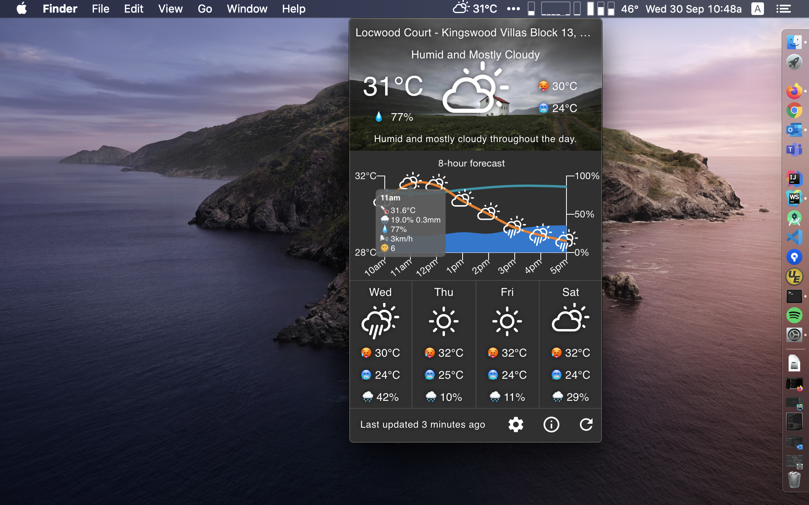
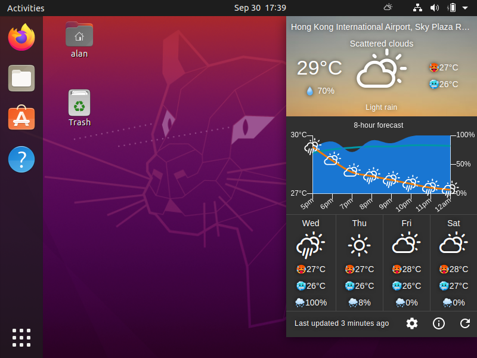
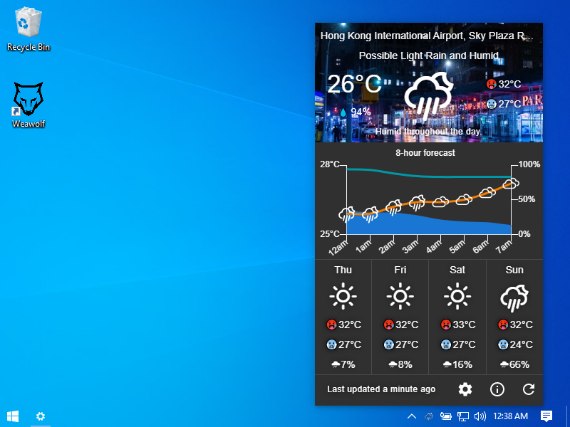
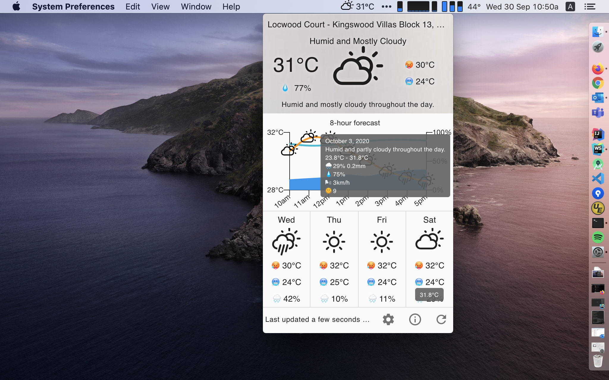
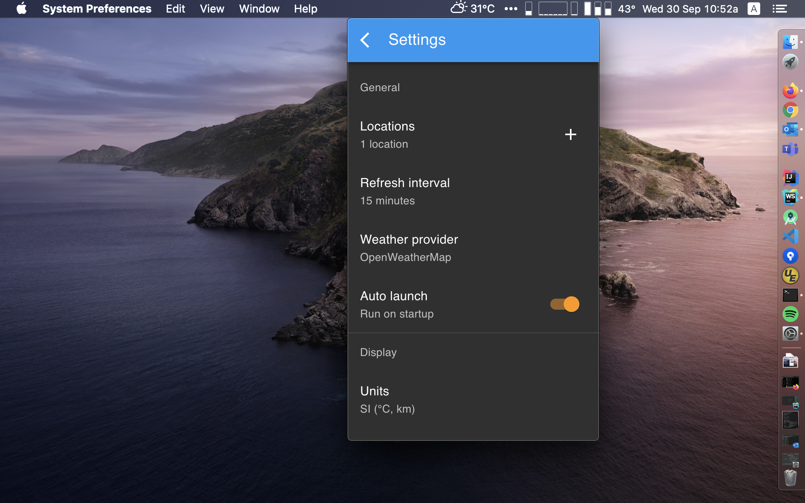
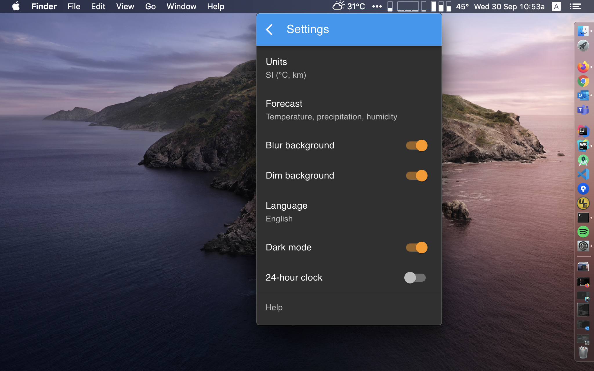

# Weawolf

[](https://github.com/ayltai/weawolf/actions)
[](https://codecov.io/gh/ayltai/weawolf)
[](https://sonarcloud.io/dashboard?id=ayltai_weawolf)
[](https://sonarcloud.io/dashboard?id=ayltai_weawolf)
[](https://sonarcloud.io/dashboard?id=ayltai_weawolf)
[](https://sonarcloud.io/dashboard?id=ayltai_weawolf)

[](https://github.com/ayltai/weawolf/releases)
[](https://github.com/ayltai/weawolf/blob/master/LICENSE)

A gorgeous weather app for your Mac, Linux, and Windows.

[](https://buymeacoff.ee/ayltai)

## Features
* Beautiful and easy to use weather app
* Supports [multiple](#weather-providers) weather providers
* Customizable weather locations
* Provides only the information that matters - temperature, humidity, precipitation, wind speed and UV index
* Hourly and daily forecast
* Auto reload data and background image
* Supports Celsius and Fahrenheit and different measurement units
* ... and more. Check out the screenshots below!

## Weather providers
* [AccuWeather](https://www.accuweather.com)
* [Dark Sky](https://darksky.net)
* [OpenWeatherMap](https://openweathermap.org)
* [Weatherbit](https://www.weatherbit.io)

## Screenshots

#### macOS



#### Ubuntu



#### Windows



#### Light theme



#### Settings
 




## Installation packages

| OS      | Download URL                                                          |
|---------|-----------------------------------------------------------------------|
| macOS   | https://github.com/ayltai/weawolf/suites/872277729/artifacts/10155420 |
| Linux   | https://github.com/ayltai/weawolf/suites/872277729/artifacts/10155419 |
| Windows | https://github.com/ayltai/weawolf/suites/872277729/artifacts/10155421 |

## Development

### Installation
1. Install [NodeJS](https://nodejs.org)
2. Install dependencies
   ```shell script
   npm i
   ```

### Configurations

#### AccuWeather API
1. Get an API key from [AccuWeather](https://developer.accuweather.com/)
2. Specify the API key for using AccuWeather:
   ```shell script
   export REACT_APP_ACCU_WEATHER_API_KEY=XXXXX
   ```

#### Dark Sky API
1. <del>Get an API key from [Dark Sky](https://darksky.net/dev) </del> (Dark Sky is no longer accepting new signups)
2. Specify the API key for using Dark Sky:
   ```shell script
   export REACT_APP_DARK_SKY_API_KEY=XXXXX
   ```

#### OpenWeatherMap API
1. Get an API key from [OpenWeatherMap](https://openweathermap.org/api)
2. Specify the API key for using OpenWeatherMap:
   ```shell script
   export REACT_APP_OPEN_WEATHER_MAP_API_KEY=xxxxx
   ```

#### Weatherbit API
1. Get an API key from [Weatherbit](https://www.weatherbit.io/api)
2. Specify the API key for using Weatherbit:
   ```shell script
   export REACT_APP_WEATHER_BIT_API_KEY=XXXXX
   ```

#### Google Maps JavaScript API
1. Go to [Google Cloud Platform Console](https://developers.google.com/maps/documentation/javascript/get-api-key) to get an API key
2. Restrict your API key to the following APIs:
   * Geocoding API
   * Maps JavaScript API
   * Places API
3. Specify the API key for using Google Maps JavaScript APIs:
   ```shell script
   export REACT_APP_GOOGLE_MAPS_API_KEY=xxxxx
   ```
#### Unsplash API
Specify the URL of your Unsplash API proxy:
```shell script
export REACT_APP_UNSPLASH_API_ENDPOINT=https://unsplash-api-proxy.appspot.com
```

### How to run in development environment
```shell script
npm run electron
```

### How to create a production build
```shell script
npm run build
```

### How to create installation packages

For macOS:
```shell script
npm run package:mac
```

For Linux:
```shell script
npm run package:nix
```

For Windows:
```shell script
npm run package:win
```

## License
This project is licensed under the terms of the [MIT license](https://github.com/ayltai/weawolf/blob/LICENSE).
